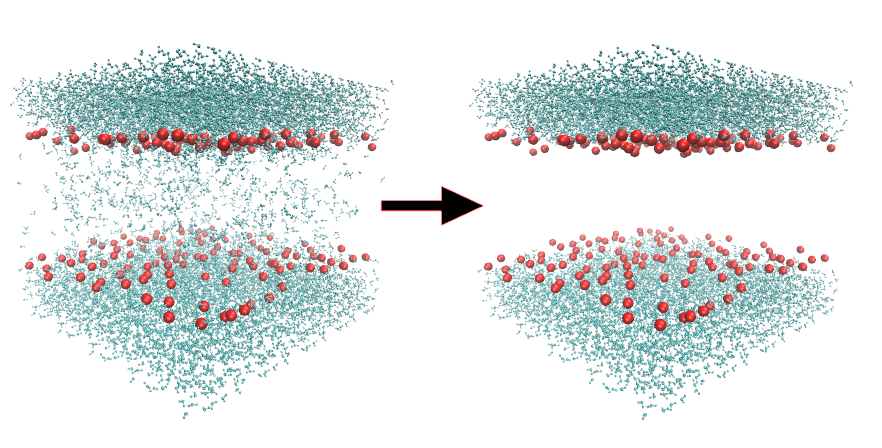

# sol_remover

sol_remover is a Python script that removes all the specified residues
from the given .gro file that are in a specific range. The intended use
is to remove water molecules from the inside of the membrane. This is done
by calculating the average of the z components of the specified atom
both for the upper and the lower leaflet. All the water molecules that are
between the leaflets are then removed.

Example run can be executed and the results viewed from the directory src/
with the following commands:

```
python3 sol_remover.py -f input.dat
vmd -m ../output/input_example.gro ../input/system_solv.gro
```
